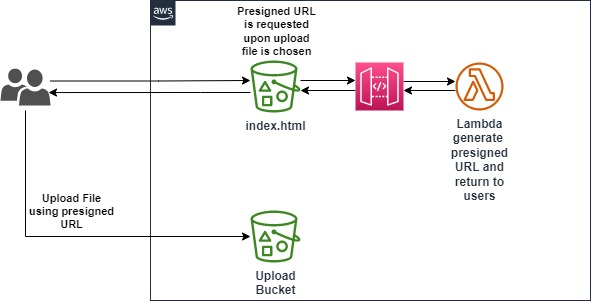

# aws-labs-s3-presigned-url-post
## Step 1
### Provision resources using CloudFormation template. Following resources will be created
- 2 S3-Buckets. One for hosting frontend upload page. Another for storing upload files
- Lambda function for generating presigned url
- Lambda Execution Role. Lambda needs `s3:PutObject` permission on upload bucket which already configured during resource creation
- REST API

## Step 2
### Upload frontend code to S3 Website Bucket
- Get API Invoke URL from CloudFormation `Output` and paste into `./html/js/api.js`
- Upload `index.html` and `./js/api.js` to root folder of S3 Website Bucket

## Diagram

